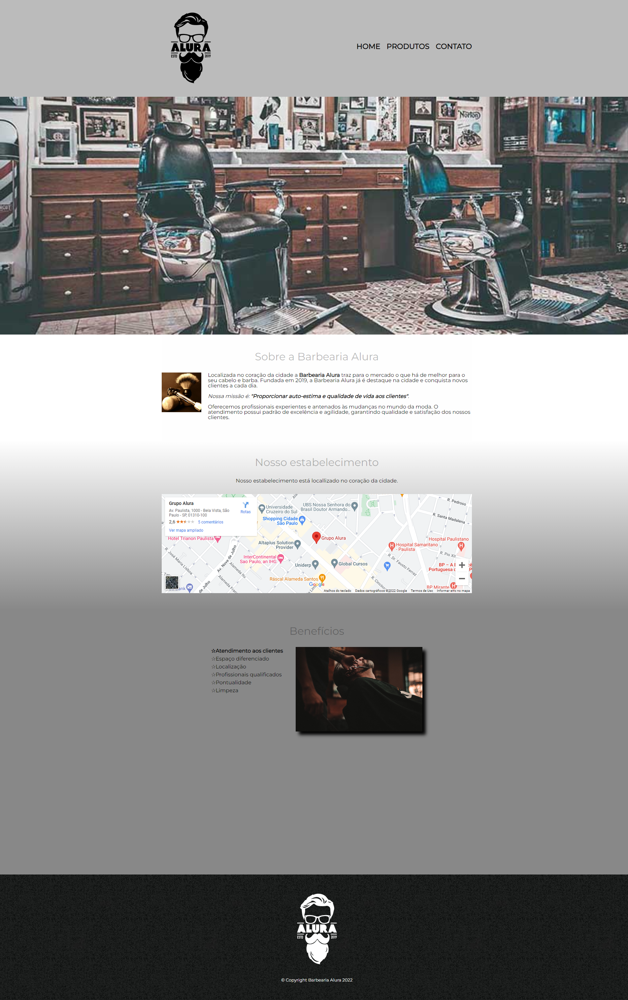

# CURSO HTML E CSS - BARBEARIA ALURA - ALURA

> Esse projeto foi construído durante o curso de HTML E CSS da escola de tecnologia Alura. Esse projeto foi dividido em 4 aulas, com carga horária estimada de 32 horas. As aulas foram divididas em:
- HTML5 e CSS3 parte 1: crie uma página da Web
- HTML5 e CSS3 parte 2: posicionamento, listas e navegação
- HTML5 e CSS3 parte 3: trabalhando com formulários e tabelas
- HTML5 e CSS3 parte 4: avançando no CSS

> [ACESSE A PÁGINA AQUI](https://feliperos-a.github.io/barbearia-alura/)

## ⚙️ Tecnologias 
- HTML
- CSS

## 🚀 Contato
> felipe.rosa@outlook.com

> [Linkedin](https://www.linkedin.com/in/ifeliperosa/)